# Final Assignment: Analytical Design
## Task 1
### a) Retrieve and clean data


```python
# import pandas library
import pandas as pd

# download dataset
dataset = pd.read_csv(
    "https://archive.ics.uci.edu/ml/machine-learning-databases/iris/iris.data",
    names =["sepal_length","sepal_width","petal_length","petal_width", "species"]
    )

'''
# remove attributes we aren't using in this exercise
dataset.drop("species", inplace=True, axis=1)
'''
# remove any rows with missing data
dataset.dropna(inplace=True)

#show first 10 rows using head() method
dataset.head(10)

```


<div>
<style scoped>
    .dataframe tbody tr th:only-of-type {
        vertical-align: middle;
    }

    .dataframe tbody tr th {
        vertical-align: top;
    }

    .dataframe thead th {
        text-align: right;
    }
</style>
<table border="1" class="dataframe">
  <thead>
    <tr style="text-align: right;">
      <th></th>
      <th>sepal_length</th>
      <th>sepal_width</th>
      <th>petal_length</th>
      <th>petal_width</th>
      <th>species</th>
    </tr>
  </thead>
  <tbody>
    <tr>
      <th>0</th>
      <td>5.1</td>
      <td>3.5</td>
      <td>1.4</td>
      <td>0.2</td>
      <td>Iris-setosa</td>
    </tr>
    <tr>
      <th>1</th>
      <td>4.9</td>
      <td>3.0</td>
      <td>1.4</td>
      <td>0.2</td>
      <td>Iris-setosa</td>
    </tr>
    <tr>
      <th>2</th>
      <td>4.7</td>
      <td>3.2</td>
      <td>1.3</td>
      <td>0.2</td>
      <td>Iris-setosa</td>
    </tr>
    <tr>
      <th>3</th>
      <td>4.6</td>
      <td>3.1</td>
      <td>1.5</td>
      <td>0.2</td>
      <td>Iris-setosa</td>
    </tr>
    <tr>
      <th>4</th>
      <td>5.0</td>
      <td>3.6</td>
      <td>1.4</td>
      <td>0.2</td>
      <td>Iris-setosa</td>
    </tr>
    <tr>
      <th>5</th>
      <td>5.4</td>
      <td>3.9</td>
      <td>1.7</td>
      <td>0.4</td>
      <td>Iris-setosa</td>
    </tr>
    <tr>
      <th>6</th>
      <td>4.6</td>
      <td>3.4</td>
      <td>1.4</td>
      <td>0.3</td>
      <td>Iris-setosa</td>
    </tr>
    <tr>
      <th>7</th>
      <td>5.0</td>
      <td>3.4</td>
      <td>1.5</td>
      <td>0.2</td>
      <td>Iris-setosa</td>
    </tr>
    <tr>
      <th>8</th>
      <td>4.4</td>
      <td>2.9</td>
      <td>1.4</td>
      <td>0.2</td>
      <td>Iris-setosa</td>
    </tr>
    <tr>
      <th>9</th>
      <td>4.9</td>
      <td>3.1</td>
      <td>1.5</td>
      <td>0.1</td>
      <td>Iris-setosa</td>
    </tr>
  </tbody>
</table>
</div>


### b)Extract statistics
#### i)Statistics of the whole dataset


```python
dataset.describe()
```


<div>
<style scoped>
    .dataframe tbody tr th:only-of-type {
        vertical-align: middle;
    }

    .dataframe tbody tr th {
        vertical-align: top;
    }

    .dataframe thead th {
        text-align: right;
    }
</style>
<table border="1" class="dataframe">
  <thead>
    <tr style="text-align: right;">
      <th></th>
      <th>sepal_length</th>
      <th>sepal_width</th>
      <th>petal_length</th>
      <th>petal_width</th>
    </tr>
  </thead>
  <tbody>
    <tr>
      <th>count</th>
      <td>150.000000</td>
      <td>150.000000</td>
      <td>150.000000</td>
      <td>150.000000</td>
    </tr>
    <tr>
      <th>mean</th>
      <td>5.843333</td>
      <td>3.054000</td>
      <td>3.758667</td>
      <td>1.198667</td>
    </tr>
    <tr>
      <th>std</th>
      <td>0.828066</td>
      <td>0.433594</td>
      <td>1.764420</td>
      <td>0.763161</td>
    </tr>
    <tr>
      <th>min</th>
      <td>4.300000</td>
      <td>2.000000</td>
      <td>1.000000</td>
      <td>0.100000</td>
    </tr>
    <tr>
      <th>25%</th>
      <td>5.100000</td>
      <td>2.800000</td>
      <td>1.600000</td>
      <td>0.300000</td>
    </tr>
    <tr>
      <th>50%</th>
      <td>5.800000</td>
      <td>3.000000</td>
      <td>4.350000</td>
      <td>1.300000</td>
    </tr>
    <tr>
      <th>75%</th>
      <td>6.400000</td>
      <td>3.300000</td>
      <td>5.100000</td>
      <td>1.800000</td>
    </tr>
    <tr>
      <th>max</th>
      <td>7.900000</td>
      <td>4.400000</td>
      <td>6.900000</td>
      <td>2.500000</td>
    </tr>
  </tbody>
</table>
</div>


#### ii) Statistics for each species


```python
# extract statistics for setosa
setosa = dataset[dataset["species"] == "Iris-setosa"]
setosa.describe()
```


<div>
<style scoped>
    .dataframe tbody tr th:only-of-type {
        vertical-align: middle;
    }

    .dataframe tbody tr th {
        vertical-align: top;
    }

    .dataframe thead th {
        text-align: right;
    }
</style>
<table border="1" class="dataframe">
  <thead>
    <tr style="text-align: right;">
      <th></th>
      <th>sepal_length</th>
      <th>sepal_width</th>
      <th>petal_length</th>
      <th>petal_width</th>
    </tr>
  </thead>
  <tbody>
    <tr>
      <th>count</th>
      <td>50.00000</td>
      <td>50.000000</td>
      <td>50.000000</td>
      <td>50.00000</td>
    </tr>
    <tr>
      <th>mean</th>
      <td>5.00600</td>
      <td>3.418000</td>
      <td>1.464000</td>
      <td>0.24400</td>
    </tr>
    <tr>
      <th>std</th>
      <td>0.35249</td>
      <td>0.381024</td>
      <td>0.173511</td>
      <td>0.10721</td>
    </tr>
    <tr>
      <th>min</th>
      <td>4.30000</td>
      <td>2.300000</td>
      <td>1.000000</td>
      <td>0.10000</td>
    </tr>
    <tr>
      <th>25%</th>
      <td>4.80000</td>
      <td>3.125000</td>
      <td>1.400000</td>
      <td>0.20000</td>
    </tr>
    <tr>
      <th>50%</th>
      <td>5.00000</td>
      <td>3.400000</td>
      <td>1.500000</td>
      <td>0.20000</td>
    </tr>
    <tr>
      <th>75%</th>
      <td>5.20000</td>
      <td>3.675000</td>
      <td>1.575000</td>
      <td>0.30000</td>
    </tr>
    <tr>
      <th>max</th>
      <td>5.80000</td>
      <td>4.400000</td>
      <td>1.900000</td>
      <td>0.60000</td>
    </tr>
  </tbody>
</table>
</div>


```python
# extract statistics for versicolor
versicolor = dataset[dataset["species"] == "Iris-versicolor"]
versicolor.describe()
```


<div>
<style scoped>
    .dataframe tbody tr th:only-of-type {
        vertical-align: middle;
    }

    .dataframe tbody tr th {
        vertical-align: top;
    }

    .dataframe thead th {
        text-align: right;
    }
</style>
<table border="1" class="dataframe">
  <thead>
    <tr style="text-align: right;">
      <th></th>
      <th>sepal_length</th>
      <th>sepal_width</th>
      <th>petal_length</th>
      <th>petal_width</th>
    </tr>
  </thead>
  <tbody>
    <tr>
      <th>count</th>
      <td>50.000000</td>
      <td>50.000000</td>
      <td>50.000000</td>
      <td>50.000000</td>
    </tr>
    <tr>
      <th>mean</th>
      <td>5.936000</td>
      <td>2.770000</td>
      <td>4.260000</td>
      <td>1.326000</td>
    </tr>
    <tr>
      <th>std</th>
      <td>0.516171</td>
      <td>0.313798</td>
      <td>0.469911</td>
      <td>0.197753</td>
    </tr>
    <tr>
      <th>min</th>
      <td>4.900000</td>
      <td>2.000000</td>
      <td>3.000000</td>
      <td>1.000000</td>
    </tr>
    <tr>
      <th>25%</th>
      <td>5.600000</td>
      <td>2.525000</td>
      <td>4.000000</td>
      <td>1.200000</td>
    </tr>
    <tr>
      <th>50%</th>
      <td>5.900000</td>
      <td>2.800000</td>
      <td>4.350000</td>
      <td>1.300000</td>
    </tr>
    <tr>
      <th>75%</th>
      <td>6.300000</td>
      <td>3.000000</td>
      <td>4.600000</td>
      <td>1.500000</td>
    </tr>
    <tr>
      <th>max</th>
      <td>7.000000</td>
      <td>3.400000</td>
      <td>5.100000</td>
      <td>1.800000</td>
    </tr>
  </tbody>
</table>
</div>


```python
# extract statistics for virginica
virginica = dataset[dataset["species"] == "Iris-virginica"]
virginica.describe()
```


<div>
<style scoped>
    .dataframe tbody tr th:only-of-type {
        vertical-align: middle;
    }

    .dataframe tbody tr th {
        vertical-align: top;
    }

    .dataframe thead th {
        text-align: right;
    }
</style>
<table border="1" class="dataframe">
  <thead>
    <tr style="text-align: right;">
      <th></th>
      <th>sepal_length</th>
      <th>sepal_width</th>
      <th>petal_length</th>
      <th>petal_width</th>
    </tr>
  </thead>
  <tbody>
    <tr>
      <th>count</th>
      <td>50.00000</td>
      <td>50.000000</td>
      <td>50.000000</td>
      <td>50.00000</td>
    </tr>
    <tr>
      <th>mean</th>
      <td>6.58800</td>
      <td>2.974000</td>
      <td>5.552000</td>
      <td>2.02600</td>
    </tr>
    <tr>
      <th>std</th>
      <td>0.63588</td>
      <td>0.322497</td>
      <td>0.551895</td>
      <td>0.27465</td>
    </tr>
    <tr>
      <th>min</th>
      <td>4.90000</td>
      <td>2.200000</td>
      <td>4.500000</td>
      <td>1.40000</td>
    </tr>
    <tr>
      <th>25%</th>
      <td>6.22500</td>
      <td>2.800000</td>
      <td>5.100000</td>
      <td>1.80000</td>
    </tr>
    <tr>
      <th>50%</th>
      <td>6.50000</td>
      <td>3.000000</td>
      <td>5.550000</td>
      <td>2.00000</td>
    </tr>
    <tr>
      <th>75%</th>
      <td>6.90000</td>
      <td>3.175000</td>
      <td>5.875000</td>
      <td>2.30000</td>
    </tr>
    <tr>
      <th>max</th>
      <td>7.90000</td>
      <td>3.800000</td>
      <td>6.900000</td>
      <td>2.50000</td>
    </tr>
  </tbody>
</table>
</div>


### c)Visualisations
#### i)Pairplots


```python
# import seaborn visualisation library
import seaborn as sns
import matplotlib.pyplot as plt

# generate scattergraph pairplot from data
plt.show(
    sns.pairplot(dataset, hue="species", kind="scatter")
)

# generate Kernel Density pairplot from data
plt.show(
    sns.pairplot(dataset, hue="species", kind="kde")
)

```


    
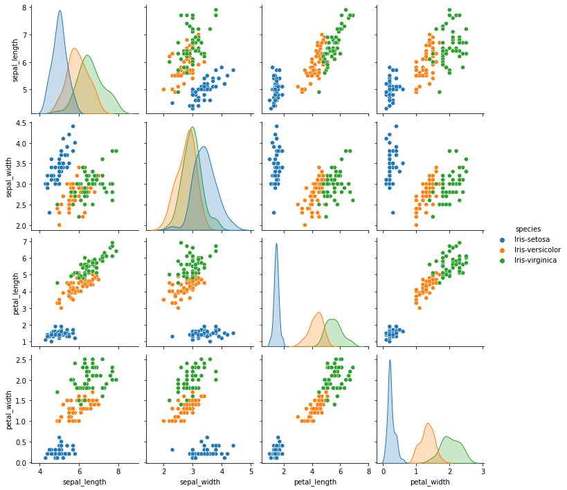
    


    
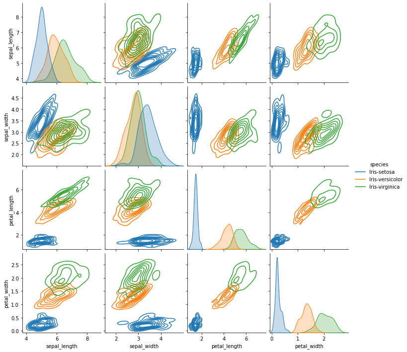
    


These pairplots suggest two things:
* Recorded values for sepal width overlap significantly between all three species. As such, sepal width may be considered a less significant attribute in terms of identification.
* There is a strong, nearly linear relationship between petal length and petal width. This linearity suggests that this dataset might be a good candidate for dimensionality reduction, e.g. either removing one of these attributes, or else by using a process like Principal Component Analysis

#### ii)A scatterplot of petal length x. petal width


```python
plt.show(
    sns.scatterplot(data=dataset, x="petal_width", y="petal_length", hue="species")
)
```


    
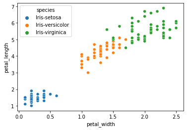
    


#### iii) Linear regression of petal length x petal width


```python
plt.show(
    sns.lmplot(data=dataset, x="petal_width", y="petal_length", )
)
```


    
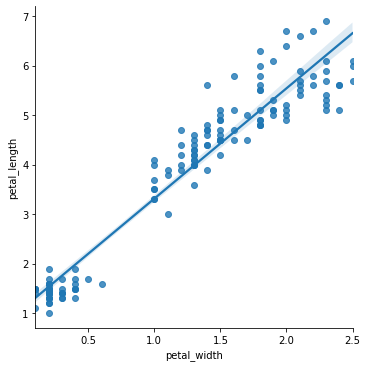
    


```python
plt.show(
    sns.lmplot(data=dataset, x="petal_width", y="petal_length", hue="species" )
)
```


    
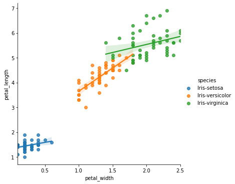
    


### d) clustering
#### i) K-means of petal length vs. sepal length


```python
from sklearn.cluster import KMeans
# from sklearn.metrics import silhouette_score
from sklearn.preprocessing import StandardScaler

# create subset of data
petals_and_sepal_length = dataset.filter(items=["petal_length","sepal_length"])

# standardize values
scaler = StandardScaler()
petals_and_sepal_length = scaler.fit_transform(petals_and_sepal_length)

# initialise kmeans class
kmeans = KMeans(
    init="random",
    n_clusters=3,
    n_init=50,
    max_iter=300,
    random_state=None)

# run clustering algorithm
kmeans.fit(petals_and_sepal_length)
cluster_labels = kmeans.labels_

# add k means labels back to original dataframe
dataset["cluster_labels"] = cluster_labels

# visualise cluster_labels against recorded species
plt.show(
    sns.scatterplot(data=dataset, x="sepal_length", y="petal_length", hue="species", style ="cluster_labels")
)
```


    
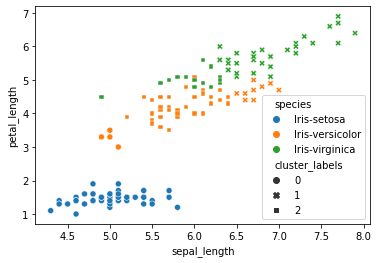
    


* this figure shows the limitations of using a k-means algorithm with these two attributes.

* whilst it is easy to see that each species broadly aligns with one of the identified clusters (e.g, iris setosa with cluster_label 0) the model is far from perfect.
* The 27 misidentified samples equate to an error rate of 18%.

#### K-means clustering of petal data


```python
# create subset of data
petals = dataset.filter(items=["petal_length","petal_width"])

# standardize values
petals = scaler.fit_transform(petals)

# run clustering algorithm
kmeans.fit(petals)
cluster_labels = kmeans.labels_

# add k means labels back to original dataframe
dataset["cluster_labels"] = cluster_labels

# visualise cluster_labels against recorded species
plt.show(
    sns.scatterplot(data=dataset, x="petal_width", y="petal_length", hue="species", style ="cluster_labels")
)
```


    
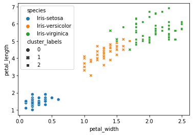
    


* the algorithm is much more succesful on these two attributes. The error rate is only 6 in 150, ie 96% sucess rate. 

### e) Conclusion
This exploratory anaysis of the dataset has suggested that:
* a strong correlation exists between petal size and petal width, though the strength of this correlation is significantly weaker at the species level.
* sepal width is one of the weaker attributes by which to identify these three iris species.
* K-means clustering (using petal length and width as its axes) can create clusters that largely align with species categorisation. 

## Task 2
### a) A flowchart of the steps for creating a dendogram based on single linkage clustering. 

Many tutorials for single-linkage clustering involve a redrawing the distance matrix of all clusters after every clustering operation. However, as single linkage is based on single links (ie, the distance between single plots in differing clusters), no new information is generated by this redrawing. If record of each point's clustering is stored against it then the original distance matrix already contains all the information needed to determine the next cluster. For clarity of code, I have skipped the redundant step of redrawing the distance matrix in each epoch. Names of the functions I will use to accomplish these steps are on the left of the diagram.


### b) Subsetting the data


```python
# filter out irrelevant attributes
sepals = dataset.filter(items=["sepal_length","sepal_width"])

# reducing set to first 6 entries
sepals = sepals.iloc[:6] 
```

### c) Code for carrying out single linkage clustering.


```python
import math

class Clustering:

    def euclidean_distance(self, ax, ay, bx, by):
        ed = math.sqrt((abs(ax-bx) + abs(ay-by)))
        return ed

    def get_coord(self, point):
        
        x = self.points.at[point, "sepal_width"]
        y = self.points.at[point, "sepal_length"]

        return x,y

    def get_distance_matrix(self):
        
        # create empty 2d matrix
        rows, cols = (6, 6)
        dm = [[0 for i in range(cols)] for j in range(rows)]

        # fill in values 
        for i in range(rows):
            point_a = self.get_coord(i)
            for j in range(cols):

                #this if/else is to stop doubling of information between identical i:j and j:i
                if i <= j:
                    dm[i][j] = None
                    continue
                else:
                    point_b = self.get_coord(j)
                    dm[i][j] = self.euclidean_distance(*point_a, *point_b)
        
        # remove blank fields
        for i in dm:
            while None in i:
                i.remove(None)

        return dm
    
    def create_cluster_records(self):
        for i in range(len(self.points)):
            self.points.at[i, "cluster_record"] = i
    
    def __init__(self, dataframe):
        self.points = dataframe
        self.distance_matrix = self.get_distance_matrix()
        self.create_cluster_records()
        
    
    def next_cluster(self):
        
        #abbreviated here for more legible code
        dm = self.distance_matrix
        
        # this tuple, once filled with appropriate values, will be passed back to caller
        next_cluster = {
            "distance" : 99999, # an arbitrary high number 
            "i" : None,
            "j" : None,
        }
        
        # iterate over distance matrix
        for i in range(len(dm)):
            for j in range(len(dm[i])):
                
                # 'is this the shortest distance we've seen?
                if dm[i][j] > next_cluster["distance"]:
                    continue
                
                # 'are these two points in different clusters? '
                elif self.points.at[i, "cluster_record"] == self.points.at[j, "cluster_record"]:
                    continue
                
                # record of best candidate for clustering based on this pass of dm so far
                else:
                    next_cluster = {
                        "distance" : dm[i][j],
                        "i" : i,
                        "j" : j,
                    }
        return next_cluster
    
    def join_clusters(self, next_cluster):
        
        #abbreviation for easier reading
        df = self.points
        i = next_cluster["i"]
        j = next_cluster["j"]
        
        # what clusters do points i and j belong to?
        i = df.at[i, "cluster_record"]
        j = df.at[j, "cluster_record"]
        print(i,j)
        
        # join all of j's cluster to i's cluster
        self.points.replace({"cluster_record": j,}, i, inplace=True)
                
    def next_epoch(self):
        
        # abbreviations
        df = self.points
        
        # find candidates for clustering 
        next_cluster = self.next_cluster()
        print(next_cluster)
        print("\n")
        
        # make the cluster and print the cluster_record
        self.join_clusters(next_cluster)
        print(df.sort_values("cluster_record"))
        print("\n")
        
        # plot showing current clusters
        plt.show(
            sns.scatterplot(data=df, x="sepal_width", y="sepal_length", hue="cluster_record", palette="Set2")
        )
        
        
        

                
                


```

### d) Performing 'Initial Setup'


```python
#initialise Clustering object using our data
c = Clustering(sepals)

#show cluster record just created
print(c.points)

# plot of points coloured by cluster_record
plt.show(
    sns.scatterplot(data=c.points, x="sepal_width", y="sepal_length", hue="cluster_record", palette="Set2")
        )

```

       sepal_length  sepal_width  cluster_record
    0           5.1          3.5             0.0
    1           4.9          3.0             1.0
    2           4.7          3.2             2.0
    3           4.6          3.1             3.0
    4           5.0          3.6             4.0
    5           5.4          3.9             5.0
    


    
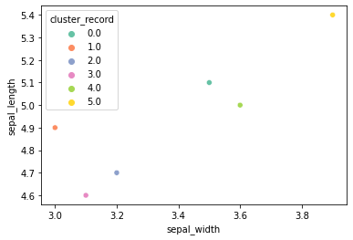
    


The cendogram looks like:


```python
#show Distance Matrix just generated
for i in c.distance_matrix:
    print(i)
```

    []
    [0.8366600265340751]
    [0.8366600265340751, 0.6324555320336761]
    [0.9486832980505138, 0.6324555320336765, 0.44721359549995865]
    [0.44721359549995765, 0.8366600265340753, 0.8366600265340753, 0.948683298050514]
    [0.8366600265340759, 1.1832159566199232, 1.1832159566199232, 1.264911064067352, 0.8366600265340757]
    

### e) Clustering Epochs
#### Epoch 1


```python
c.next_epoch()
```

    {'distance': 0.44721359549995765, 'i': 4, 'j': 0}
    
    
    4.0 0.0
       sepal_length  sepal_width  cluster_record
    1           4.9          3.0             1.0
    2           4.7          3.2             2.0
    3           4.6          3.1             3.0
    0           5.1          3.5             4.0
    4           5.0          3.6             4.0
    5           5.4          3.9             5.0
    
    
    


    
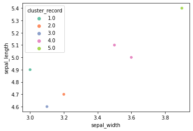
    


Dendogram looks like: 
####  Epoch 2


```python
c.next_epoch()
```

    {'distance': 0.44721359549995865, 'i': 3, 'j': 2}
    
    
    3.0 2.0
       sepal_length  sepal_width  cluster_record
    1           4.9          3.0             1.0
    2           4.7          3.2             3.0
    3           4.6          3.1             3.0
    0           5.1          3.5             4.0
    4           5.0          3.6             4.0
    5           5.4          3.9             5.0
    
    
    


    
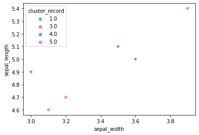
    


Dendogram looks like: 
#### Cluster 3


```python
c.next_epoch()
```

    {'distance': 0.6324555320336761, 'i': 2, 'j': 1}
    
    
    3.0 1.0
       sepal_length  sepal_width  cluster_record
    1           4.9          3.0             3.0
    2           4.7          3.2             3.0
    3           4.6          3.1             3.0
    0           5.1          3.5             4.0
    4           5.0          3.6             4.0
    5           5.4          3.9             5.0
    
    
    


    
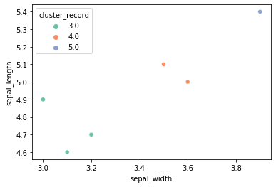
    


Dendogram looks like: 

#### Epoch 4


```python
c.next_epoch()
```

    {'distance': 0.8366600265340751, 'i': 2, 'j': 0}
    
    
    3.0 4.0
       sepal_length  sepal_width  cluster_record
    0           5.1          3.5             3.0
    1           4.9          3.0             3.0
    2           4.7          3.2             3.0
    3           4.6          3.1             3.0
    4           5.0          3.6             3.0
    5           5.4          3.9             5.0
    
    
    


    
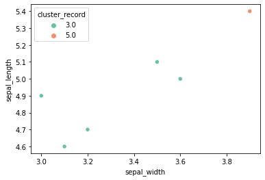
    


Dendogram looks like: 

#### Epoch 5


```python
c.next_epoch()
```

    {'distance': 0.8366600265340757, 'i': 5, 'j': 4}
    
    
    5.0 3.0
       sepal_length  sepal_width  cluster_record
    0           5.1          3.5             5.0
    1           4.9          3.0             5.0
    2           4.7          3.2             5.0
    3           4.6          3.1             5.0
    4           5.0          3.6             5.0
    5           5.4          3.9             5.0
    
    
    


    
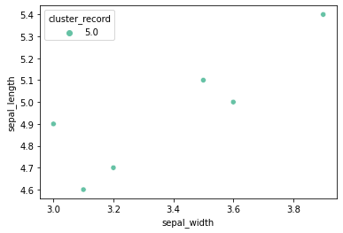
    


Dendogram looks like: 

#### Check of my finished dendogram against another library


```python
from scipy.cluster.hierarchy import dendrogram, linkage
l = linkage(sepals)
plt.show(dendrogram(l, color_threshold=0))
```


    
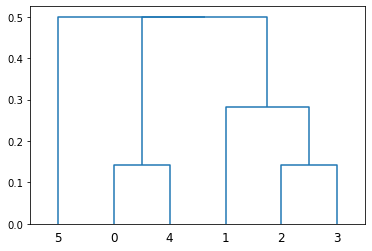
    


* My clustering, and the attached dendogram, matches that produced by SciPy in all except the final clustering.
* In my plot I joined cluster (1,2,3) to (0,4) before joining the new cluster (0,1,2,3,4) to (5).
* SciPy joined (1,2,3) to (0,4) at the same time as joining (5).
* This can be explained by differences in rounding and/or floating point errors:
    * The distance of p5:p4, as printed in Epoch 5: 0.8366600265340757
    * The distance of  p2:p0, as printed in Epoch 4: 0.8366600265340751
    * The difference between these two numbers according to Python: 5.551115123125783e-16 ie 0.0000000000000005
    * The difference between these numbers according to Google: 0 
* As this difference in calculation is so minute, and has no practical effect on our conclusion, this discrepancy has been ignored.

### Conclusion
* If we mark our cut-off point through the longest vertical line on the dendogram (excluding single value clusters, ie point 5) we create the following figure:

* We can describe the contents of the figure as either 3 clusters, or as 2 clusters and an outlier.
* If we were to treat this small sample size as representative of all irises, we could infer either two or three species from our dendogram.
* It is clear, however, that our very small sample size, misrepresents the range of possible values. In doing so, it over-emphasizes the significance of differences between our six samples. 
* If we load the sepals information for the entire iris dataset, a very different context emerges:


```python
for i in range (6):
    dataset.at[i, "species"] = "small_sample"

plt.show(
    sns.scatterplot(data=dataset, x="sepal_length", y="sepal_width", hue="species", style="species")
)
```


    
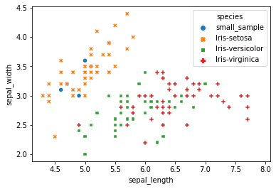
    


* All members of our small sample size fall within the range for Iris-Setosa.
* Checking the original dataset, it can be seen that all members of the small sample size do belong to Iris-Setosa.
* Only one species is shown on our dendogram, though its focus on such a small range might overstate the importance of distances within that species.
